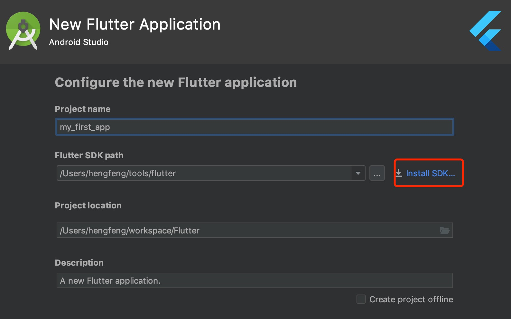
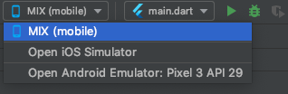
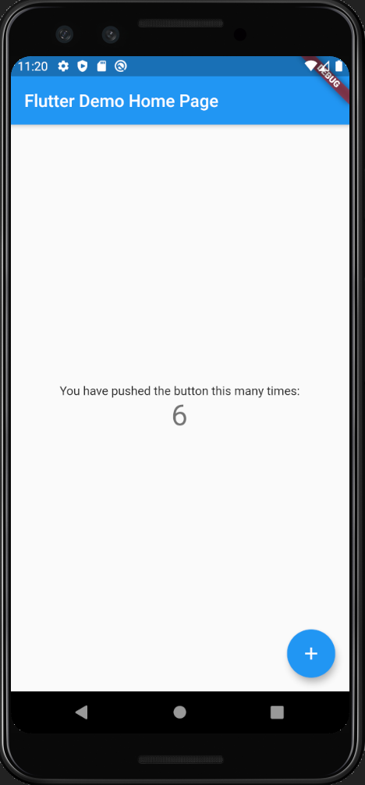

# Flutter 学习笔记

## 一，环境搭建

### Flutter SDK安装

* 1. 在Flutter官网下载最新安装包，或者直接在Android Studio创建Flutter工程时下载SDK

* 2. 如果是下载安装包，解压到对应目录，然后设置到环境变量中：

```
$ cd ~
$ vim .bash_profile
```
 
修改.bash_profile：

```
export PATH="$PATH:'pwd'/flutter/bin"
```

* 3. 运行[^flutter doctor]来检测环境是否搭建成功

```
$ flutter doctor
```


### 创建和运行一个Flutter项目

* 1. 可以通过命令行的方式创建和运行Flutter项目：

```
$ flutter create my_first_app
$ cd my_first_app
$ flutter run -d 7B2A282E-24AC-4E9E-BEA1-F5F8F19AFB7C
$ flutter run -d ‘iPhone X’
```

* 2. 推荐使用Android Studio等IDE来创建项目(注意可以在这里安装SDK)：



> 需要安装 flutter 和 Dart 这2个插件 

* 3. 在Android Sutido中，可以指定启动的iOS或者Android的模拟器或者真机:



* 4. 运行后可以看到初始的demo界面：



> 任意的修改保存后，flutter会自动刷新UI 


## 二，什么是声明式UI


## 三，Flutter入门基础


## 四，项目结构、资源、依赖、本地化


## 五，认识视图(Views)


## 六，布局与列表


## 七，状态管理


## 八，路由与导航


## 九，线程和异步UI


## 十，手势检测及触摸事件处理


## 十一，主题和文字处理


## 十二，表单输入与富文本


## 十三，调用硬件、第三方SDK以及平台交互、通知


