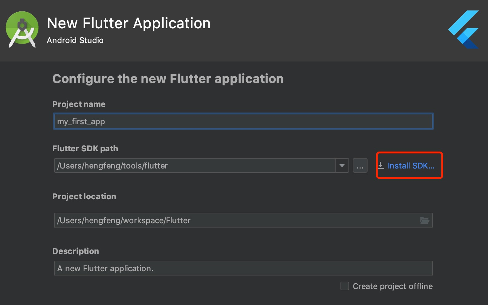
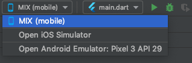
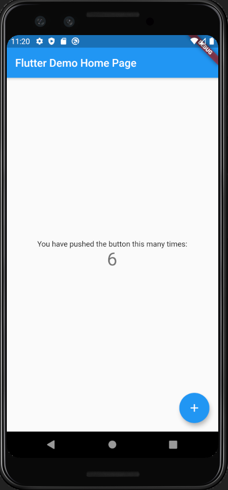
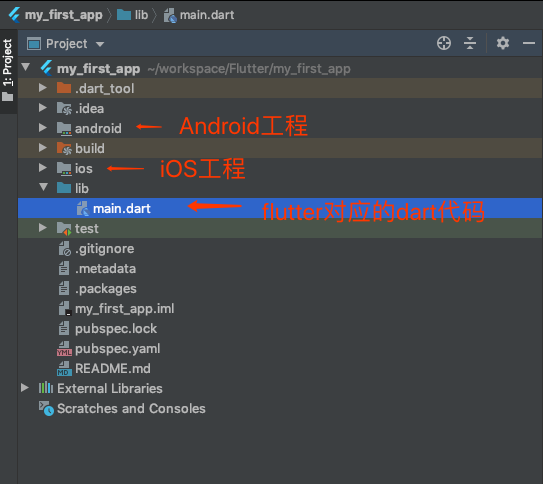
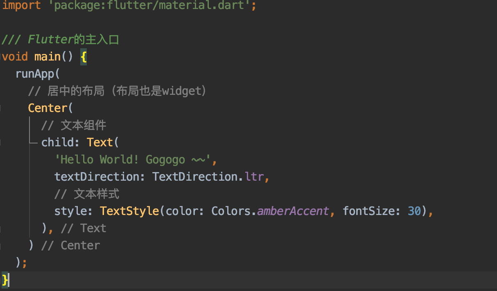
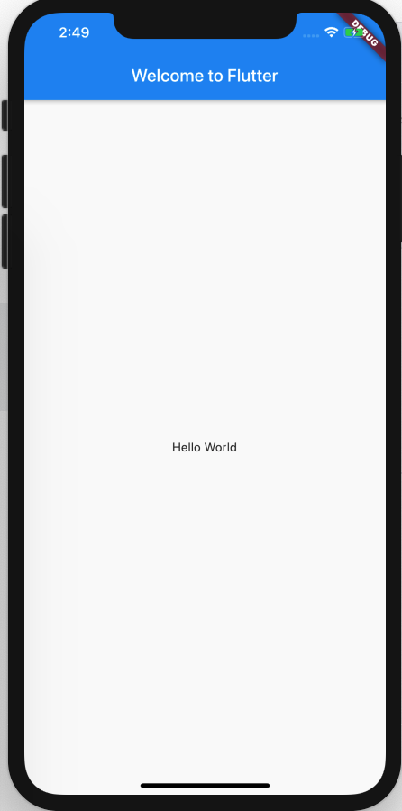

# Flutter入门笔记

## 一，环境搭建

### Flutter SDK安装

* 1. 在[Flutter官网](https://flutter.dev/docs/development/tools/sdk/releases)下载最新安装包，或者直接在Android Studio创建Flutter工程时下载SDK

* 2. 如果是下载安装包，解压到对应目录，然后设置到环境变量中：

```
$ cd ~
$ vim .bash_profile
```
 
修改.bash_profile：

```
export PATH="$PATH:'pwd'/flutter/bin"
```

* 3. 运行[^flutter doctor]来检测环境是否搭建成功

```
$ flutter doctor
```


### 创建和运行一个Flutter项目

* 1. 可以通过命令行的方式创建和运行Flutter项目：

```
$ flutter create my_first_app
$ cd my_first_app
$ flutter run -d 7B2A282E-24AC-4E9E-BEA1-F5F8F19AFB7C
$ flutter run -d ‘iPhone X’
```

* 2. 推荐使用Android Studio等IDE来创建项目(注意可以在这里安装SDK)：



> 需要安装 flutter 和 Dart 这2个插件 

* 3. 在Android Sutido中，可以指定启动的iOS或者Android的模拟器或者真机:



* 4. 运行后可以看到初始的demo界面：



> 任意的修改保存后，flutter会自动刷新UI 


### Flutter项目的构成

由于flutter是跨平台的，所以在工程中包含了android和ios的工程结构，可以分别用Android Studio和XCode来打开：




## 二，入门基础知识


### 1. 如何导入Widget

> 在Fluter中，万物皆Widget!!!

在Flutter中，要使用<font color=red>Material Design</font>库中的小部件，则需要导入<font color=red></font>material.dart包；
如果要使用iOS样式的widget，则要导入<font color=red>Cupertino</font>库。
要使用更基本的窗口widget集，需要导入widget库。当然，也可以导入自己编写的widget:

```java
import 'package:flutter/material.dart';
import 'package:flutter/cupertino.dart'; 
import 'package:flutter/widgets.dart'; 
import 'package:flutter/my_custom_widgets.dart'; 
```

### 2. 如何写一个Hello World

在flutter中，可以使用Center和Text这2个widget来实现一个最简单的hello world：




### 3. 如何生成更复杂的Widget树

> 重要的事情再说一遍：在Fluter中，万物皆Widget!!!

在flutter中，widget是用户界面的基本构建块，每个窗口widget都嵌套在父窗口的widget中，并从其父窗口继承属性。甚至应用程序对象本身也是一个组件。

Widget可以定义：

- 结构元素 - 如按钮或菜单
- 文本元素 - 像字体或颜色主题
- 类似布局的填充或对齐的一个方向

```
import 'package:flutter/material.dart';

/// Flutter的主入口
void main() => runApp(MyApp());

class MyApp extends StatelessWidget {

  @override
  Widget build(BuildContext context) {
    // TODO: implement build
    return MaterialApp(
      title: 'Welcome to Flutter',
      home: Scaffold(
        appBar: AppBar(
          title: Text('Welcome to Flutter'),
        ),
        body: Center(
          child: Text('Hello World'),
        ),
      ),
    );
  }
}
```




## 三，项目资源、依赖、本地化

### 1. 如何存放图片资源以及如何处理不同分辨率

和安卓不同，flutter不区分res和assets，所有都是作为assets处理。assets可以被放置到任何属性文件夹中。

在flutter中，assets可以是任意类型的文件，而不仅仅是图片。例如，可以把json放在在my-assets文件夹中。并在<font color=red>pubspec.yaml</font>文件中声明assets:

```
assets:
	- my-assets/data.json
	- my-assets/logo.png
```

然后在代码中可以通过<font color=red>AssetBundle</font>来访问它：

```
import 'package:flutter/services.dart';

Future<String> loadAsset() async {
  return await rootBundle.loadString('my-assets/data.json');
}
```
	
对于图片而言，flutter遵循了一个简单的基于像素密度的格式。Image assets可能是1.0x, 2.0x, 3.0x或是其他的任何倍数。

Android不同像素密度的图片和flutter的像素比率的对应关系：

```
ldpi    0.75x
mdpi    1.0x
hdpi    1.5x
xhdpi   2.0x
xxhdpi  3.0x
xxxhdpi 4.0x
```

所以，举个栗子，可以把图片(1.0x)放置到images文件中，并把其他分辨率的图片放在对应的子文件夹中，并接上合适的比例系数，就像这样：

```
images/my_icon.png       // Base: 1.0x image 
images/2.0x/my_icon.png  // 2.0x image
images/3.0x/my_icon.png  // 3.0x image
```

然后在pubspec.yaml中声明这个图片资源(只要一句):

```
assets:
	- images/my_icon.png
```

之后就可以通过AssetImage来访问，或者直接通过Image Widget加载：

```
return AssetImage('images/my_icon.png');

@override
Widget build(BuildContext context) {
	return Image.asset("images/my_image.png");
}
```

### 2. 如何添加Flutter项目所需要的依赖

在android中，是通过gradle文件来添加依赖。flutter使用dart构建系统和Pub包管理器来处理依赖：

```
dependencies:
	flutter:
		sdk: flutter
		
	google_sign_in: ^3.0.3
```

用于查找Flutter插件的网站: [Pub Site](https://pub.dev/flutter/packages)


### 3. 如何处理本地化(多语言)

略


## 四，认识视图(Views)

### 1. 谁是flutter中的view

### 2. 如何更新Widgets

### 3. 如何布局

### 4. 如何在布局中添加或者删除组件

### 5. 如何对widget做动画

### 6. 如何绘制

### 7. 如何构建自定义widget

### 8. 如何设置widget的透明度


## 五，布局与列表


## 六，状态管理


## 七，路由与导航


## 八，线程和异步UI


## 九，手势检测及触摸事件处理


## 十，主题和文字处理


## 十一，表单输入与富文本


## 十二，调用硬件、第三方SDK以及平台交互、通知


g