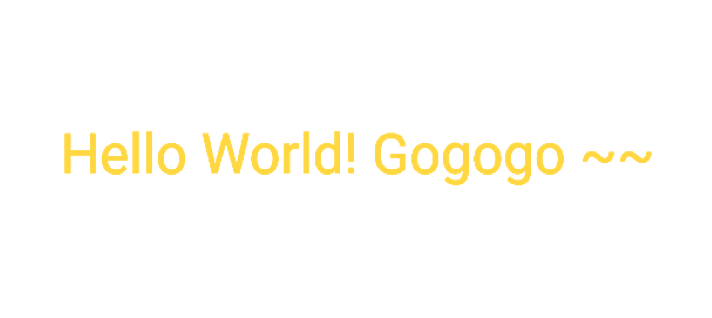

# Flutter入门笔记

## 一，环境搭建

### Flutter SDK安装

* 1. 在[Flutter官网](https://flutter.dev/docs/development/tools/sdk/releases)下载最新安装包，或者直接在Android Studio创建Flutter工程时下载SDK

* 2. 如果是下载安装包，解压到对应目录，然后设置到环境变量中：

```
$ cd ~
$ vim .bash_profile
```
 
修改.bash_profile：

```
export PATH="$PATH:'pwd'/flutter/bin"
```

* 3. 运行[^flutter doctor]来检测环境是否搭建成功

```
$ flutter doctor
```


### 创建和运行一个Flutter项目

* 1. 可以通过命令行的方式创建和运行Flutter项目：

```
$ flutter create my_first_app
$ cd my_first_app
$ flutter run -d 7B2A282E-24AC-4E9E-BEA1-F5F8F19AFB7C
$ flutter run -d ‘iPhone X’
```

* 2. 推荐使用Android Studio等IDE来创建项目(注意可以在这里安装SDK)：


> 需要安装 flutter 和 Dart 这2个插件 

* 3. 在Android Sutido中，可以指定启动的iOS或者Android的模拟器或者真机:


* 4. 运行后可以看到初始的demo界面：


> 任意的修改保存后，flutter会自动刷新UI 


### Flutter项目的构成

由于flutter是跨平台的，所以在工程中包含了android和ios的工程结构，可以分别用Android Studio和XCode来打开：


## 二，入门基础知识


### 1. 如何导入Widget

> 在Fluter中，万物皆Widget!!!

在Flutter中，要使用<font color=red>Material Design</font>库中的小部件，则需要导入<font color=red></font>material.dart包；
如果要使用iOS样式的widget，则要导入<font color=red>Cupertino</font>库。
要使用更基本的窗口widget集，需要导入widget库。当然，也可以导入自己编写的widget:

```java
import 'package:flutter/material.dart';
import 'package:flutter/cupertino.dart'; 
import 'package:flutter/widgets.dart'; 
import 'package:flutter/my_custom_widgets.dart'; 
```

### 2. 如何写一个Hello World

在flutter中，可以使用Center和Text这2个widget来实现一个最简单的hello world：





### 3. 如何生成更复杂的Widget树

> 重要的事情再说一遍：在Fluter中，万物皆Widget!!!

在flutter中，widget是用户界面的基本构建块，每个窗口widget都嵌套在父窗口的widget中，并从其父窗口继承属性。甚至应用程序对象本身也是一个组件。

Widget可以定义：

- 结构元素 - 如按钮或菜单
- 文本元素 - 像字体或颜色主题
- 类似布局的填充或对齐的一个方向

```
import 'package:flutter/material.dart';

/// Flutter的主入口
void main() => runApp(MyApp());

class MyApp extends StatelessWidget {

  @override
  Widget build(BuildContext context) {
    // TODO: implement build
    return MaterialApp(
      title: 'Welcome to Flutter',
      home: Scaffold(
        appBar: AppBar(
          title: Text('Welcome to Flutter'),
        ),
        body: Center(
          child: Text('Hello World'),
        ),
      ),
    );
  }
}
```


## 三，项目资源、依赖、本地化

### 1. 如何存放图片资源以及如何处理不同分辨率

和安卓不同，flutter不区分res和assets，所有都是作为assets处理。assets可以被放置到任何属性文件夹中。

在flutter中，assets可以是任意类型的文件，而不仅仅是图片。例如，可以把json放在在my-assets文件夹中。并在<font color=red>pubspec.yaml</font>文件中声明assets:

```
assets:
	- my-assets/data.json
	- my-assets/logo.png
```

然后在代码中可以通过<font color=red>AssetBundle</font>来访问它：

```
import 'package:flutter/services.dart';

Future<String> loadAsset() async {
  return await rootBundle.loadString('my-assets/data.json');
}
```
	
对于图片而言，flutter遵循了一个简单的基于像素密度的格式。Image assets可能是1.0x, 2.0x, 3.0x或是其他的任何倍数。

Android不同像素密度的图片和flutter的像素比率的对应关系：

```
ldpi    0.75x
mdpi    1.0x
hdpi    1.5x
xhdpi   2.0x
xxhdpi  3.0x
xxxhdpi 4.0x
```

所以，举个栗子，可以把图片(1.0x)放置到images文件中，并把其他分辨率的图片放在对应的子文件夹中，并接上合适的比例系数，就像这样：

```
images/my_icon.png       // Base: 1.0x image 
images/2.0x/my_icon.png  // 2.0x image
images/3.0x/my_icon.png  // 3.0x image
```

然后在pubspec.yaml中声明这个图片资源(只要一句):

```
assets:
	- images/my_icon.png
```

之后就可以通过AssetImage来访问，或者直接通过Image Widget加载：

```
return AssetImage('images/my_icon.png');

@override
Widget build(BuildContext context) {
	return Image.asset("images/my_image.png");
}
```

### 2. 如何添加Flutter项目所需要的依赖

在android中，是通过gradle文件来添加依赖。flutter使用dart构建系统和Pub包管理器来处理依赖：

```
dependencies:
	flutter:
		sdk: flutter
		
	google_sign_in: ^3.0.3
```

用于查找Flutter插件的网站: [Pub Site](https://pub.dev/flutter/packages)


### 3. 如何处理本地化(多语言)

略


## 四，认识视图(Views)

### 1. 谁是flutter中的view

在Android中，View是屏幕上显示的所有内容的基础，按钮、工具栏、输入框等一切都是view;

在flutter中我们可以将widget当做是android中的view，但他们并完全等价。首先widget是具有不同的生命周期：它们是不可变的，它们会存在于状态被改变之前。每当widget或其状态发生变化时，futter框架都会创建一个新的widget实例树。相比之下，android视图被绘制一次，并且调用invalidate之前不会重绘。

此外，与view不同，flutter的widget很轻巧，部分原因在于它的不变性。因为它本身不是视图，并且不是直接绘制任何东西，而是对UI及其语义的描述。


### 2. 如何更新Widgets

在Android中要更新视图，我们可以直接通过对应的方法来操作更改；在flutter中，widget是不可变的，不会直接更新。相反，我们可以通过操纵widget的状态来更新它们。

这就是有状态和无状态widget的概念呢。 StatelessWidget就是一个没有状态的widget，适用于当我们描述的用户界面不依赖于对象中的配置信息是。

如果要根据HTTP网络请求或者用户交互后收到的数据动态更改UI，则必须使用StatefulWidget并告诉flutter框架widget的状态已经更新，以便更新该widget。

无状态widget和有状态widget之间的重要区别在于StatefulWidgets具有一个state对象，该对象存储状态数据并将其传递到树重建中，因此状态不会丢失。


### 3. 如何布局

在android中，我们通过XML编写布局；在flutter中，我们通过编写一个widget树来声明布局：

下面这个例子展示了如何展示一个带有padding的简单widget:

```
class MyApp extends StatelessWidget {

  @override
  Widget build(BuildContext context) {
    return Scaffold(
      appBar: AppBar(
        title: Text('Sample App'),
      ),
      body: Center(
        child: MaterialButton(
          onPressed: () {},
          child: Text('Hello'),
          padding: EdgeInsets.only(left: 10.0, right: 10.0),
        ),
      ),
    );
  }
}
```

### 4. 如何对widget做动画

在flutter中，使用动画库来包裹widgets，而不是创建一个动画widget。它使用AnimationController，是一个可以暂停，寻找，停止，反转动画的Animation类型。我们可以创建一个或多个的Animation并附加给一个controller。


### 5. 如何构建自定义widget

在flutter中，推荐组合多个小的widgets来构建一个自定义的widget，而不是扩展它。

举个栗子，如果要构建一个CustomButton，并在构造器中传入它的label，那就组合RaiseButton和label，而不是扩展RaisedButton。


```
class CustomButton extends StatelessWidget {

	final String label;
	CustomButton(this.label);
	
	@override
	Widget build(BuildContext context) {
		return new RaisedButton(
			onPressed: () {},
			child: new Text(label)
		);
	}

}
```

### 6. 如何设置widget的透明度

在flutter中，如果要改变透明度，我们可以给widget包裹一个Opacity(不透明性) widget来做到这一点：

```
Opacity (
	opacity: 0.5,
	child: Text('透明度50%')
)
```

## 五，布局与列表

### 1.  如何设置布局

在flutter中，使用Row或者Colum widget来实现控件水平或垂直排列

```
Row/Column (
	mainAxisAlignment: MainAxisAlignment.center,
	children: <Widget>[
		Text('Row one'),
		Text('Row two'),
		Text('Row three'),
	],
) 

```


在flutter中，有几种方法可以实现widget相对于彼此位置相对排列。可以通过Column，Row和Stack的组合实现RelativeLayout的效果。

Container 控制一个布局的样式和属性

Center 负责居中它的子widget

Stack 可以控制子widget在一层，子widget可以完全或者部分覆盖基础widget。Stack控件将其子项相对于其框的边缘定位。

### 2. 列表组件的使用

在Flutter中，可以使用ListView达到列表效果，但是在flutter中没有adapter，我们唯一要做的就是控制这个list中要展示的数据。

- 如何知道点击了列表中哪个item?
	- 通过GestureDetector来监听item的点击事件

### 3. 如何动态更新ListView

- 一个更新ListView的简单方法是，在setState()中创建一个新的List，并把旧List的数据拷贝给新的List。虽然这样很简单，但当数据集很大时，并不推荐这样做：
- 一个推荐的，高效的且有效的做法是，使用ListView.Builder来构建列表。它接收2个主要参数：列表的初始长度，和一个ItemBuilder方法。


## 六，状态管理

### 什么是StatelessWidget

StatelessWidget是一个不需要状态更改的widget，它没有要管理的内部状态。
当描述的用户界面部分不依赖于对象本身中的配置信息以及widget的BuildContext时，无状态widget非常有用。

比如AboutDialog, CircleAvator和Text都是StatelessWidget的子类。

### 什么是StatefulWidget

StatefulWidget是可变状态的widget。可以调用setState告诉flutter框架，某个状态发生了变化，flutter会重新运行build方法，以便应用程序可以应用最新状态。

状态是在构建widget时可以同步读取的信息可能会在widget的生命周期中发生变化。确保在状态改变时及时通知状态变化是widget实现者的责任。当widget可以动态更改时，需要使用StatefulWidget。

例如，通过键入表单或移动滑块来更改widget的状态，或者它可以随时间变化，或者数据推送更新UI。

Checkbox，Radio，Slider，InkWell，Form 和 TextField 都是有状态的widget，也是StatefulWidget的子类。


## 七，路由与导航

### 1. 如何实现路由跳转

要在Flutter中切换屏幕，我们可以访问路由以绘制新的widget。管理多个页面有2个核心概念和类：Route和Navigator。

Route是应用程序的屏幕或页面的抽象(可以认为是Activity)，Navigator是管理Route的Widget。Navigator可以通过push和pop route以实现页面切换。

- 具体制定一个由路由名构成的Map。（MaterialApp）
- 直接跳转到一个路由。(WidgetApp)

下面构建一个Map的例子：

```
void main() {
	runApp(MaterialApp(
			home: MyAppHome(),
			routes: <String, WidgetBuilder> {
				'/a' : (BuildContext context) => MyPage(title: 'page A'),
				'/b' : (BuildContext context) => MyPage(title: 'page B'),
				'/c' : (BuildContext context) => MyPage(title: 'page C'),
			}
		)
	);
}
```

通过把路由的名字push给一个Navigator来跳转：

```
Navigator.of(context).pushNamed('/b');
```

还可以使用Navigator的push方法，该方法将给定route添加到导航器的历史记录中：

```
Navigator.push(
	context,
	MaterialPageRoute(
		builder: (BuildContext context) => UsualNavscreen()
	)
);
```

### 2. 如何获取路由跳转返回的结果

在Android中有startActivityForResult来获取跳转页面后返回的结果，那么在flutter中Navigator类不仅用来处理flutter中的路由，还被用来获取路由返回的结果。

通过await等待路由返回的结果来达到这点：

比如，打开一个页面让用户选择一个地点：

```
Map coordinates = await Navigator.of(context).pushNamed('/location');
```

然后在选择地址页面，退出(pop)时携带结果：

```
Navigator.of(context).pop({'lat': 43,822, 'long': -78.2323});
```


## 八，线程和异步UI

可以使用Dart语言的async/await来实现异步操作，


要使用http包，在pubspec.yaml中添加如下依赖：

```
dependencies:
	...
# 	http: ^0.12.0+
```

如何进行网络请求

```
loadData() async {
	String dataURL = "https://rokid.com/v1/getList";
	http.Response response = await http.get(dataURL);
	setState(() {
		widget = json.decode(response.body);
	});
}
```


## 九，手势检测及触摸事件处理

在flutter中，有2种方法来添加点击监听：

- 1. 如果widget本身支持事件监听，直接传递给它一个函数，并在这个函数里实现响应方法：

```
@override
Widget build(BuildContext context) {
	return RaisedButton(
		onPressed: () {
			print('click');
		},
	);
}
```


- 2. 如果widget本身不支持事件监听，则在外面包裹一个GestureDetector，并给它的onTap属性传递一个函数：

```
class SampleApp extends StatelessWidget {
	@override
	Widget build() {
		return Scaffold(
			body: Center(
				child: GestureDetector(
					child: FlutterLogo(
						size: 200.0,
					),
					onTap: () {
						print("tap");
					}
				),
			),
		);
	}
}
```

使用GestureDetector，可以监听多种手势，例如：

* 点击
	* onTapDown
	* onTapUp
	* onTap
	* onTapCancel

* 双击
	* onDoubleTap

* 长按
	* onLongPress


